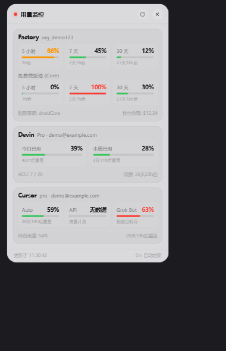

# Quota Panel

**中文** | [English](README.en.md)

macOS / Windows 桌面上的常驻额度监控小组件。屏幕顶部一个「灵动岛」样式的胶囊，
点开是一张卡片，同时显示 **Factory (Droid)、Devin、Cursor（含 Grok Bot）** 三个数据源的实时额度。



> 截图里的账号、组织、额度都是**假数据**，由 `scripts/make-ui-preview.cjs` 生成，
> 不涉及任何真实凭据。

Rust + Tauri v2 实现，界面是一个零依赖的单文件 HTML，没有 Electron。

---

## 它显示什么

| 数据源 | 卡片内容 | 凭据从哪来 |
| --- | --- | --- |
| **Factory (Droid)** | 5 小时 / 7 天 / 30 天三个用量窗口、Core 免费模型池、按量余额 | 本机 `droid` CLI 已登录的凭据 |
| **Devin** | 今日已用 / 本周已用百分比、各自的重置时间 | 本机 Devin Desktop / CLI 已登录的凭据 |
| **Cursor** | Auto / API / **Grok Bot** 三个额度池、综合用量、账期重置时间 | 本机 Cursor 桌面端已登录的凭据 |

关于 Grok Bot：它是 **Cursor 的产品**，周额度由 Cursor 的服务端接口（`GetSandUsageStatus`）
提供，吃的也是 Cursor 的登录态，所以它的额度合并显示在 Cursor 卡片里，而不是单独一张卡。

关于 Devin 一栏：每轮刷新都**直接调 Cognition 的 seat-management 接口**
（`server.codeium.com` 上的 protobuf over Connect-RPC），**没有本地缓存兜底**——
调用失败就如实显示错误，不会拿旧数字冒充。自动每 5 分钟一轮，↻ / 托盘菜单可立即刷新；
前提是这台机器上登录着 Devin Desktop 或 CLI（只读取其登录态）。该接口为逆向所得、非官方，
厂商随时可能改动，所以这一栏的定位是**能用但尚不成熟**。详见
[English](README.en.md) 的 "Devin: how the data gets here" 一节。

顶部胶囊上只显示所有数据源里**最紧的那个百分比**，颜色按阈值变化
（默认 70% 转黄、90% 转红，阈值在 `models.rs` 的 `AppConfig` 里）。

## 前置条件（先看这里）

本应用**不保存任何账号密码，也没有登录界面**。它只读取你本机已经登录好的客户端凭据
（全部以只读方式打开）。所以：

- 想看哪一栏，就先在这台机器上登录对应的客户端：Cursor 桌面端、Devin Desktop 或 CLI、`droid` CLI。
- 没登录的数据源会在卡片上显示「读取失败」，**不影响其它数据源**——
  三个源是并发独立拉取的，一个挂了不会拖垮另外两个。
- Cursor 一栏里如果只有 Grok 有数、Auto/API 显示「无数据」（或反过来），
  说明是其中某一个接口单独失败，页脚会写明原因。

具体读取的位置（全部只读，括号内为对应数据源）：

- `~/.factory/auth.v2.loginkeychain` 或 `auth.v2.keyring`，加上钥匙串 / Windows 凭据管理器里的
  `auth-encryption-key`（Factory）——文件是 AES-256-GCM 密文，在内存中解密，密钥不落盘
- `~/.config/devin/credentials.toml`、`~/.codeium/windsurf/credentials.toml`，
  或 Devin Desktop 的 `state.vscdb`（Devin）
- Cursor 桌面端的 `state.vscdb` 与 `~/.cursor/cli-config.json`（Cursor 与 Grok Bot）

## 构建与运行

前置：

- [Rust stable](https://rustup.rs)
- macOS：Xcode Command Line Tools（`xcode-select --install`）
- Windows：MSVC 构建工具 + Windows SDK；WebView2 运行时（Windows 10/11 一般已自带）

```bash
cd quota-panel-tauri/src-tauri

cargo run                        # 开发模式
cargo build --release            # 发布构建，产物在 target/release/
cargo build --release --bin quota  # 只编命令行版本
```

macOS 上直接运行 `target/release/quota-panel-tauri` 即可；
想要 `.app` / `.dmg` / `.msi` 安装包用 `cargo tauri build`（需先装
[tauri-cli](https://tauri.app/start/prerequisites/)）。

## 命令行版本

除了桌面组件，同一个 crate 里还有一个 `quota` 命令行程序，和界面共用同一套取数逻辑，
适合脚本、周报、SSH 里快速看一眼。**它必须单独编译**：Windows 上的主程序是 GUI 子系统、
本身没有控制台，直接拿主程序跑是打印不出东西的。

```bash
cargo build --release --bin quota    # 产物 target/release/quota(.exe)

./quota                  # 三个数据源
./quota factory          # 只看 Factory
./quota devin            # 只看 Devin
./quota cursor           # 只看 Cursor（含 Grok Bot）
./quota --json           # 机器可读输出
./quota watch            # 每 60 秒刷新（Ctrl+C 退出）
```

环境变量：`QUOTA_LANG=en|zh` 指定输出语言（默认跟随系统），`NO_COLOR=1` 关闭颜色。
退出码：全部数据源都取不到数时为 `1`，参数写错为 `2`，正常为 `0`。

## 怎么用

- 启动后屏幕顶部出现一个胶囊，上面是各源里最紧的百分比和一个状态点。
- **点胶囊**展开成卡片；**点卡片右上的 ✕** 收回胶囊。
- **↻ 按钮**：立即手动刷新一次。
- **托盘图标**（菜单栏）：左键点按会显示并聚焦窗口；右键菜单里有「立即刷新额度」和「退出 Quota Panel」。
- 数据默认**每 5 分钟自动刷新一次**，卡片底部会显示上次更新时间。
- **界面语言跟随系统**：系统语言是中文时，界面、托盘菜单和所有错误提示都显示中文，
  其余情况显示英文。应用内没有语言切换开关。

## 已知限制

- **配置没有持久化**：刷新间隔和颜色阈值目前写死在代码里（5 分钟 / 70% / 90%），
  没有配置文件也没有设置界面，改了源码才生效。
- 接口都是**未公开的内部接口**，厂商随时可能改动导致某一栏失效；失效时会显示具体错误而不是假数据。
- macOS 构建启用了 `macOSPrivateApi`（无边框透明窗口所需），因此**无法提交 Mac App Store**。

## 风险与免责声明

请在使用和二次分发前读完这一段。

- 本工具调用的是 Cursor / Devin / Factory **未公开的内部接口**，并读取它们存放在本机的登录态。
  这些行为**可能违反相应厂商的服务条款**，风险（包括账号被限制的可能）由使用者自行承担。
- 所有出站请求的 User-Agent 均如实报告为 `quota-panel/<版本>`，**不伪装成任何厂商的客户端**。
- 本应用只读本地凭据，不写入、不上传、不另行存储任何 token；
  网络请求只发往对应厂商的官方域名（`cursor.com`、`api2.cursor.sh`、`server.codeium.com`、Factory 的 API）。
  对 Cursor / Devin 的本地数据库一律以 SQLite 只读模式打开。
- Grok Bot 的百分比由 Cursor 服务端按美元额度折算，**分母未公开**，数值仅供趋势参考，
  不要拿它做精确的余量判断。
- 本项目与 Anysphere (Cursor)、xAI、Cognition (Devin)、Factory 无任何关联。
  Cursor、Grok Bot、Devin、Factory / Droid 均为各自所有者的商标。

## 开发

```
quota-panel-tauri/
├── src-tauri/
│   ├── src/
│   │   ├── lib.rs           # 应用入口、托盘、后台轮询、三路并发的调度
│   │   ├── cursor.rs        # Cursor usage-summary + Grok Bot 的 GetSandUsageStatus
│   │   ├── devin.rs         # Devin（protobuf over Connect-RPC）
│   │   ├── factory.rs       # Factory / Droid
│   │   ├── credentials.rs   # 各客户端本地凭据的只读取用（含 AES-GCM 解密）
│   │   ├── http.rs          # 共享 client 的 UA 与有限次重试
│   │   ├── commands.rs      # Tauri IPC 命令
│   │   ├── models.rs        # 前后端共用的数据结构
│   │   └── bin/quota.rs     # 命令行版本，与界面共用上面的 fetcher
│   └── Cargo.toml           # [[bin]] quota 必须单独声明，见「命令行版本」
└── ui/index.html            # 整个界面：单文件、零外部依赖
```

## 测试

取数逻辑依赖本机登录态，CI 上跑不了真实接口，所以**纯函数一律配单元测试**：
日期解析、protobuf 编解码、AES-GCM 解密、重试判定、前后端数据契约、CLI 的输出与双语文案。

```bash
cd quota-panel-tauri/src-tauri
cargo test                    # 单元测试
cargo clippy --all-targets    # 静态检查
```

界面（单文件、无构建步骤）另有一个静态检查脚本，会核对文案字典的 key 完整性、
前后端字段名一致性和 JS 语法：

```bash
node scripts/check-ui.cjs
```

`scripts/` 下还有两个生成测试向量的一次性脚本（用 Node 当对照，见该目录的 README）。

性能参考（macOS 实测，含 WebKit 的 GPU / WebContent / Networking 子进程）：
空闲约 **150 MB RSS**，作为对照，它替代的 Electron 版本约 470 MB。
